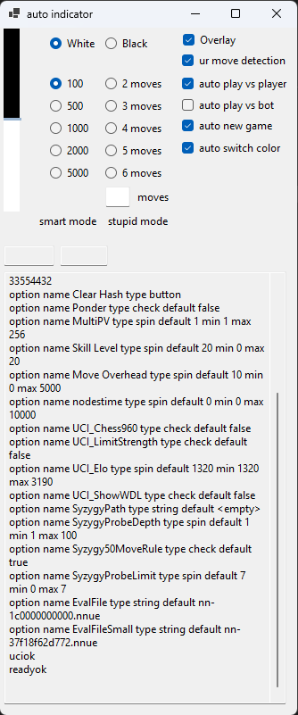
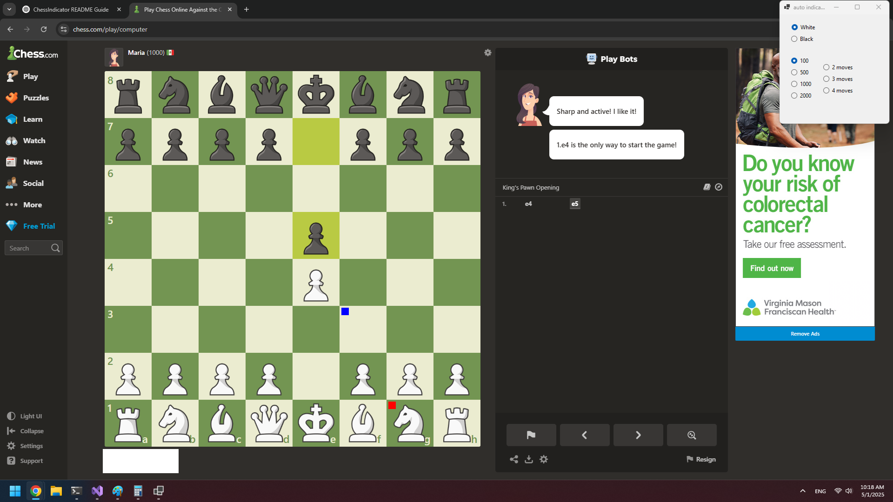

# ChessIndicator

**ChessIndicator** is an automatic on-screen helper for chess.com. It captures the current board position, converts it into a FEN string, sends it to Stockfish for analysis, and then overlays the best move suggestion directly on your screen.

---

## 🚀 Features

- Automatically reads the current chessboard position from chess.com.
- Uses Stockfish to calculate the best move.
- Displays the move suggestion directly on-screen.
- Supports different sides (White/Black).
- Adjustable calculation depth/speed.
- Option to reduce strength and increase detection resistance (3, 4, or 5-move mode).

---

## 🧠 How It Works

1. Captures the chessboard from a fullscreen Chrome browser window at 1080p resolution.
2. Converts the visual board into a FEN string.
3. Sends the FEN string to Stockfish for evaluation.
4. Displays the best move recommendation on-screen.

---

## 🖥️ User Interface

The main UI includes two groups of radio buttons:

- **Side Selection**:  
  - Choose whether you're playing as **White** or **Black**.

- **Calculation Speed**:  
  - Options: `100ms`, `500ms`, `1000ms`, `2000ms`  
  - Lower values yield quicker but less accurate results (~1500 ELO at 100ms depending on CPU).

- **Move Depth (Optional)**:  
  - Choose `3`, `4`, or `5` moves to analyze.  
  - Fewer moves = weaker but more stealthy.

---

## 📦 Requirements

1. **Stockfish**:
   - Requires a local Stockfish binary.
   - Default path:
     ```
     C:\stockfish\stockfish-windows-x86-64-avx2.exe
     ```
   - You must change the `stockfishPath` in the code if your executable is located elsewhere.

2. **Display Setup**:
   - Works on **1920x1080 resolution**.
   - Requires **Google Chrome** in **fullscreen mode** on **chess.com**.

---

## ⚠️ Important Notes

- **Do not hold or drag a chess piece during analysis.**  
  Mouse interaction can block the image recognition process.

- This tool relies on pixel-perfect board capture. Use it with the specified resolution/browser setup for best results.

- **Use responsibly.**  
  Tools like this may violate terms of service on chess platforms.

---

## 🔧 Customization

- The **default chessboard top-left position is hardcoded** at:
    public static int starting_position_x = 224;
    public static int starting_position_y = 152;
    public static int chess_board_height_w = 808;

## 🔧 Example


